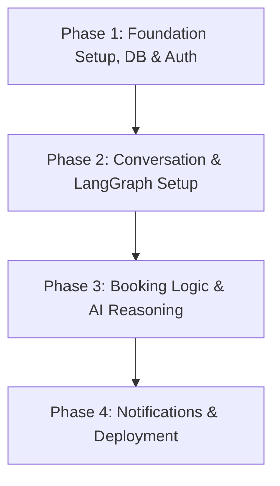

# AI Hospital Appointment Orchestrator - Project Roadmap

This document outlines the step-by-step roadmap for implementing the AI Hospital Appointment Orchestrator, designed for **Sunrise Multispeciality Hospital**. The roadmap is structured in four successive phases to establish a robust foundation, orchestrate the AI workflows, implement core business logic, and deliver notifications.

---

## 🗺️ Phase Overview



---

## 📂 Project Directory Structure (Target)
The roadmap aligns with the following modular folder structure:
```text
hospital-appointment-orchestrator/
├── frontend/                 # React SPA (Tailwind CSS, Axios)
└── backend/                  # FastAPI Application
    ├── main.py               # API Gateway & Entry Point
    ├── graph/                # LangGraph workflow definition & state
    ├── agents/               # Individual LangGraph node agents
    ├── services/             # Core business logic
    ├── repositories/         # Database access (SQLAlchemy)
    ├── schemas/              # Pydantic schemas
    ├── prompts/              # System prompt templates
    └── utils/                # Helper functions (JWT, SMTP, etc.)
```

---

## 🛠️ Phase 1: Project Setup, Database, & Authentication

Establish the fundamental components, database schema, credentials, and authentication mechanics.

### 1.1 Project Initialization & Configuration
- **Backend Setup**:
  - Initialize FastAPI directory structure.
  - Setup virtual environment (`venv` or `poetry`) and install dependencies: `fastapi`, `langgraph`, `sqlalchemy`, `psycopg2-binary`, `pydantic`, `pyjwt`, `python-dotenv`.
  - Configure environment variables (`.env`):
    - `DATABASE_URL` (Neon PostgreSQL)
    - `OPENROUTER_API_KEY` (Gemini/Claude access)
    - `JWT_SECRET`
    - `EMAIL_USER` / `EMAIL_PASSWORD`
- **Frontend Setup**:
  - Create a React app with Vite.
  - Setup Tailwind CSS for modern aesthetics.
  - Install Axios and routing dependencies.

### 1.2 Database Schema & Seed Data
- Setup **PostgreSQL** schema using **SQLAlchemy** models:
  - `User` (id, name, email, phone, age, gender, preferred_language)
  - `Doctor` (id, name, specialization, department, experience, languages, fee)
  - `Schedule` (id, doctor_id, date, start_time, end_time, status)
  - `Appointment` (id, patient_id, doctor_id, schedule_id, symptoms, booking_status, created_at)
  - `Conversation` (id, user_id, messages, current_state, updated_at)
- Create a migration/seed script to pre-populate departments and dummy doctors (e.g., Dr. Rahul Shah in General Medicine, Dr. Priya Mehta in Cardiology, etc.) along with their corresponding availability schedules.

### 1.3 Authentication & User Management
- Implement **JWT Token-based authentication** in FastAPI.
- Setup login/registration API endpoints (`/api/auth/register`, `/api/auth/login`).
- Handle user roles: **Patient**, **Doctor**, and **Hospital Admin** to protect corresponding dashboards.
- Design frontend mockups for Login and Register pages.

---

## 💬 Phase 2: Chat & LangGraph Orchestration

Implement the core conversational framework, establishing state representation and routing logic via LangGraph.

### 2.1 LangGraph State & Schema Definition
- Define the shared **`HospitalState`** class representing the single source of truth across nodes:
  - `session_id`, `user_id`, `messages`, `language`, `intent`, `patient_info`, `symptoms`, `department`, `priority`, `doctor_candidates`, `selected_doctor`, `available_slots`, `selected_slot`, `booking_status`, `errors`

### 2.2 Core Node Implementation (Part I)
- **Input Agent**: Cleans and validates incoming text or voice transcripts; auto-detects language (English, Hindi, Gujarati).
- **Intent Router Agent**: Parses the user message to classify the intent (`BOOK`, `CANCEL`, `RESCHEDULE`, `CHECK_STATUS`) and routes to the appropriate flow.
- **Patient Details Agent**: Extracts details (name, age, gender, preferred language) using structured LLM output (Pydantic models).
- **Missing Info Checker (Retry Loop)**: Detects missing fields, queries the user, and updates state before proceeding to the symptom checks.

### 2.3 Conversation Interface
- Connect the React frontend to the backend `/api/chat` POST endpoint.
- Develop the **AI Chat UI** featuring:
  - Interactive speech-to-text input (Browser Speech Recognition API).
  - Text-to-speech output (Browser Speech Synthesis API).
  - Clear conversational history displaying agent thoughts (optional) and patient inputs.

---

## 📅 Phase 3: Appointment Booking Logic

Implement the intelligent triage, doctor matching, schedule matching, and transactional booking operations.

### 3.1 Medical Reasoning & Safety Nodes
- **Symptom Extraction Agent**: Extracts primary symptoms, duration, severity, and inferred body parts.
- **Medical Decision & Emergency Agent**: 
  - Evaluates priority and runs emergency detection checks (e.g., chest pain, stroke symptoms, breathing difficulty).
  - **Emergency Route**: Halts booking immediately, sends a critical alert, and routes to an emergency exit prompting the patient to call emergency numbers.
- **Human-in-the-Loop Node**: Implements interrupts for human approval (hospital staff review) if the AI classification confidence is low (<80%) or override flags are triggered.

### 3.2 Recommendation & Schedule Optimization
- **Doctor Recommender Agent**: Queries the database to retrieve and rank doctors based on department match, language compatibility, and patient history.
- **Schedule Optimizer Node**: Queries the schedule table, filtering out hospital holidays, and matches availability within the 30-day window.
- **Alternative Slot Finder**: Handles slot conflicts. If the preferred slot is taken, loops up to 3 times to suggest nearby schedules, alternative days, or general physicians.

### 3.3 Transactional Booking Execution
- **Confirmation Agent**: Requests the patient to accept or reject the recommended slot.
- **Booking Agent**: Saves the appointment and updates doctor schedules within a **SQL database transaction** to prevent race conditions (double-booking).
- Develop API endpoints:
  - `/api/appointment/book`
  - `/api/appointment/cancel`
  - `/api/appointment/reschedule`

---

## ✉️ Phase 4: Notifications & System Polish

Integrate email notifications, complete final UI dashboards, and launch the deployment.

### 4.1 Notifications & Email Workflows
- **Notification Agent**: Runs asynchronously after a successful database write.
- Connect to **Gmail SMTP** to dispatch formatted booking, cancellation, and rescheduling confirmation emails.
- Add retry logic (maximum 3 attempts) for SMTP connection timeouts.

### 4.2 Dashboards & System Integration
- Build the **Admin Dashboard**:
  - Manage doctor schedules, view all hospital bookings, check analytics, and update hospital settings.
- Build the **Doctor Dashboard**:
  - View daily calendars, patient lists, and specific appointment notes/symptoms.
- Build the **Patient Profile**:
  - View past appointment history, upcoming bookings, and update personal profiles.

### 4.3 Error Recovery, Testing, & Deployment
- Finalize global graph recovery strategies (DB timeouts, LLM API outages, network drops).
- Write unit tests for individual LangGraph nodes.
- Perform end-to-end integration testing of patient flows.
- **Deployment**:
  - Deploy frontend to **Vercel**.
  - Deploy backend server to **Render** or **Railway**.
  - Setup database on **Neon PostgreSQL**.

---

## 📈 Success Criteria & Validation
- **Efficiency**: Patients can complete a booking using the AI assistant in under 2 minutes.
- **Safety**: 100% of emergency cases are correctly caught and diverted.
- **Accuracy**: Zero double-booking occurrences during concurrent testing.
- **Accessibility**: Smooth language toggling between English, Hindi, and Gujarati.
