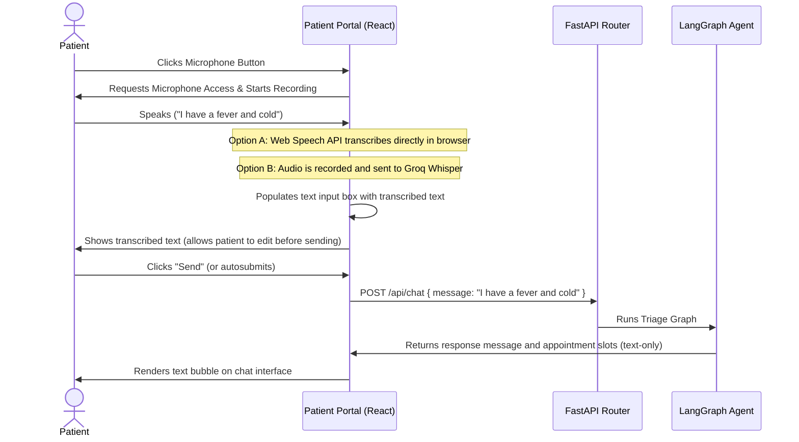

# Feature Guide: Voice Input Integration for Patient Portal (`feash4.md`)

This document outlines the step-by-step architecture, flow, and free API options to enable patients to dictate their symptoms or commands by voice. As requested, this focuses on **voice-to-text input only** (the AI agent will continue to reply in text).

---

## 🎙️ Recommended Free API Options

To translate patient speech into text, we have two excellent free options depending on whether you want the processing to happen in the browser (client-side) or on the server.

### Option 1: Web Speech API (SpeechRecognition) — *Recommended*
* **What it is**: A native browser API supported by modern browsers (Google Chrome, Apple Safari, MS Edge).
* **Cost**: **100% Free** (no subscription, no registration, no API keys).
* **Setup**: Zero backend changes. It runs entirely in the React frontend.
* **Pros**: Extremely fast (real-time stream typing), zero server load, supports multiple languages, and requires no credential management.
* **Cons**: Speech-to-text accuracy is dependent on the browser's engine (Chrome uses Google Cloud, Safari uses Siri's engine).

### Option 2: Groq Whisper API
* **What it is**: Groq offers a cloud-hosted version of OpenAI's Whisper model (the gold standard for speech recognition).
* **Cost**: **Free Tier** (currently offers free developer keys with high rate-limit thresholds).
* **Setup**: Capture audio in React, send the audio blob to FastAPI, and FastAPI calls the Groq Whisper API.
* **Pros**: State-of-the-art accuracy (handles accents, medical terms, and whispers extremely well).
* **Cons**: Requires capturing audio format files (.wav/.webm) and sending them over HTTP.

---

## 🔄 Voice Input Architectural Flow

Here is the step-by-step flow of how the system will process voice input:



---

## 🛠️ Step-by-Step Implementation Guide

### Step 1: Add Microphone UI Button to Input Bar
In the React frontend (`PatientDashboard.jsx`), we will add a microphone button inside the input container.
* When inactive, it shows a grey mic icon.
* When active/recording, it pulses red to indicate it is listening.

### Step 2: Implement Browser SpeechRecognition (Web Speech API)
Here is the React hook template that we will implement to capture voice:

```javascript
// Check browser compatibility
const SpeechRecognition = window.SpeechRecognition || window.webkitSpeechRecognition;

const useSpeechToText = (onTranscript) => {
  const [isListening, setIsListening] = useState(false);
  const recognitionRef = useRef(null);

  useEffect(() => {
    if (!SpeechRecognition) {
      console.warn("Speech recognition is not supported in this browser.");
      return;
    }

    const recognition = new SpeechRecognition();
    recognition.continuous = false; // Stop listening when user stops speaking
    recognition.interimResults = false; // Show final results only
    recognition.lang = "en-US"; // Language selection

    recognition.onstart = () => setIsListening(true);
    recognition.onend = () => setIsListening(false);
    recognition.onerror = (event) => console.error("Speech Recognition Error:", event.error);
    
    recognition.onresult = (event) => {
      const transcript = event.results[0][0].transcript;
      onTranscript(transcript);
    };

    recognitionRef.current = recognition;
  }, [onTranscript]);

  const startListening = () => {
    if (recognitionRef.current && !isListening) {
      recognitionRef.current.start();
    }
  };

  const stopListening = () => {
    if (recognitionRef.current && isListening) {
      recognitionRef.current.stop();
    }
  };

  return { isListening, startListening, stopListening, isSupported: !!SpeechRecognition };
};
```

### Step 3: Bind Voice Output to Input Field
* When `onTranscript` triggers, it appends the transcribed text to the `inputValue` state.
* The patient reviews the text in the message box, corrects any misheard words if necessary, and presses the "Send" button to proceed.

---

## 📋 Next Steps
1. **Choose an option**: If you prefer **Option 1 (Web Speech API)**, we can write the implementation immediately since it requires no API keys and is fully client-side.
2. **Provide API Key (if choosing Option 2)**: If you prefer **Option 2 (Groq/Whisper)**, sign up for a free developer account at [Groq Console](https://console.groq.com/) and provide the Groq API key to hook it up to the backend.
