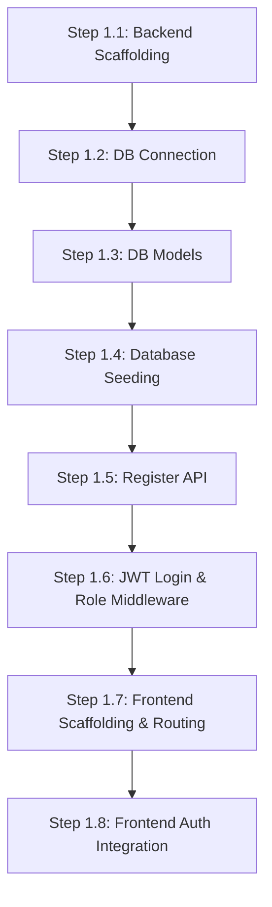

# Phase 1 Implementation Plan: Project Setup, Database & Authentication

This document outlines the small, sequential, and testable steps required to implement Phase 1 of the **AI Hospital Appointment Orchestrator**. 

---

## 🙋‍♀️ Confirmed Design Decisions
The following architecture and configuration decisions are finalized:

> [!NOTE]
> 1. **Slots per Doctor per Day**:
>    * We will generate **10–12 slots per doctor per day** (each slot is 30 mins with a 5-min buffer, resulting in a 35-minute cycle).
>    * These will be generated sequentially within each doctor's defined working hours (up to the 10–12 slots limit).
> 2. **Doctor User Accounts**:
>    * The seeding script will automatically create a corresponding `User` account for each doctor with the default password `doctor123` and role `doctor`, linking it to their entry in the `doctors` table.
> 3. **Database & Environment**:
>    * PostgreSQL (Neon) is the target database. The database connection URL will be supplied in the `.env` file via `DATABASE_URL`.

---

## 🗺️ Step-by-Step Implementation

---

### Step 1.1: Backend Project Setup & FastAPI Scaffolding
* **Objective**: Initialize the backend project directory, install core dependencies, and expose a health check route.
* **Scope**: Setup python configuration, `.env` parsing, and backend server entry point.
* **Files to Create**:
  * `backend/requirements.txt`
  * `backend/.env` & `backend/.env.example`
  * `backend/main.py`
* **Implementation Tasks**:
  1. Create a `requirements.txt` file listing core dependencies: `fastapi`, `uvicorn`, `pydantic`, `pydantic-settings`, `sqlalchemy`, `psycopg2-binary`, `pyjwt`, `passlib[bcrypt]`, `python-dotenv`, `langgraph`.
  2. Implement `backend/main.py` configuring a FastAPI instance with CORS middleware enabled (allowing requests from React frontend).
  3. Implement a health check endpoint `GET /health` returning `{"status": "ok", "app": "AI Hospital Appointment Orchestrator"}`.
  4. Setup environment variable parsing using Pydantic Settings.
* **API Endpoints**:
  * `GET /health`
* **Validation & Edge Cases**:
  * Run the server with `uvicorn main:app --reload` and verify `/health` returns `200 OK`.
* **Definition of Done**: Health check route returns expected JSON, and backend starts without errors.

---

### Step 1.2: Database Connection & Configuration
* **Objective**: Configure SQLAlchemy connection to PostgreSQL database.
* **Scope**: DB engine creation, session management, and DB session injection dependency.
* **Files to Create**:
  * `backend/database.py`
* **Implementation Tasks**:
  1. Read `DATABASE_URL` from environment variables.
  2. Create a SQLAlchemy Engine with connection pool parameters.
  3. Configure a `sessionmaker` bind (disable autocommit/autoflush).
  4. Create a declarative `Base` class.
  5. Implement `get_db()` yield dependency to manage DB sessions per API request.
* **Database Changes**: None (connection establishment only).
* **Validation & Edge Cases**:
  * Write a quick validation task/script to verify that connecting to the database succeeds and doesn't leak connections.
* **Definition of Done**: Backend successfully connects to PostgreSQL instance on startup.

---

### Step 1.3: Database Models Setup
* **Objective**: Translate PDF Entity designs into SQLAlchemy database models.
* **Scope**: Define tables for Users, Departments, Doctors, Schedules, Appointments, and Conversations.
* **Files to Create/Modify**:
  * `backend/models.py`
* **Implementation Tasks**:
  1. **`users` Table**: `id` (UUID, PK), `name` (str), `email` (str, Unique, Indexed), `phone` (str, Unique), `password_hash` (str), `role` (enum: 'patient', 'doctor', 'admin'), `age` (int), `gender` (str), `preferred_language` (str).
  2. **`departments` Table**: `id` (int, PK), `name` (str, Unique), `floor` (int), `description` (str).
  3. **`doctors` Table**: `id` (int, PK), `user_id` (UUID, FK referencing users.id, Nullable), `name` (str), `specialization` (str), `department_id` (int, FK referencing departments.id), `experience_years` (int), `languages` (JSON representation of languages), `consultation_fee` (numeric).
  4. **`doctor_schedules` Table**: `id` (int, PK), `doctor_id` (int, FK referencing doctors.id), `date` (Date), `start_time` (Time), `end_time` (Time), `status` (enum: 'available', 'booked', 'holiday').
  5. **`appointments` Table**: `id` (UUID, PK), `patient_id` (UUID, FK referencing users.id), `doctor_id` (int, FK referencing doctors.id), `schedule_id` (int, FK referencing doctor_schedules.id), `symptoms` (str), `booking_status` (enum: 'pending', 'confirmed', 'cancelled'), `created_at` (DateTime).
  6. **`conversations` Table**: `id` (UUID, PK), `user_id` (UUID, FK referencing users.id), `messages` (JSON), `current_state` (JSON), `updated_at` (DateTime).
* **Database Changes**: Setup tables, relationships, and indices.
* **Validation & Edge Cases**:
  * Run table creation via SQLAlchemy's `Base.metadata.create_all` during app startup or via a setup script. Verify all tables exist in database.
* **Definition of Done**: Schema is fully generated in the target PostgreSQL instance.

---

### Step 1.4: Database Seeding Script
* **Objective**: Seed departments, doctors, schedules, and corresponding doctor user accounts.
* **Scope**: Seed data based on Pages 2-6 of the PDF.
* **Files to Create**:
  * `backend/scripts/seed_data.py`
* **Implementation Tasks**:
  1. Add 10 departments (General Medicine, Cardiology, Orthopedics, Neurology, Pediatrics, Dermatology, ENT, Gynecology, Ophthalmology, Dentistry) with correct floors and descriptions.
  2. Add 10 doctors matching exact PDF profiles (languages, fees, experience).
  3. Generate doctor `User` accounts so each doctor has a dashboard login.
  4. Generate a 30-day schedule window for each doctor:
     - Check doctor working days (e.g., Dr. Priya Mehta: Mon-Fri).
     - Exclude hospital holidays (Republic Day, Holi, Independence Day, Gandhi Jayanti, Diwali, Christmas).
     - Generate slots within their working hours (e.g., 9:00 AM - 4:00 PM) at 35-minute intervals (30 min slot + 5 min buffer).
* **Validation & Edge Cases**:
  * Ensure holidays are correctly skipped.
  * Verify slot times do not cross working hour boundaries.
* **Definition of Done**: Seeding script runs to completion, populating all tables with clean, spec-compliant data.

---

### Step 1.5: User Registration API
* **Objective**: Implement user registration with input validation.
* **Scope**: Validate registration parameters and securely write users to database.
* **Files to Create/Modify**:
  * `backend/schemas/user.py` (Pydantic schemas)
  * `backend/utils/security.py` (Password hashing utilities)
  * `backend/routers/auth.py` (Registration endpoints)
  * Modify `backend/main.py` (Include auth router)
* **Implementation Tasks**:
  1. Create Pydantic validation schemas for Registration (validating email, phone, age, preferred language).
  2. Implement bcrypt password hashing using `passlib`.
  3. Create `POST /api/auth/register` to create a new Patient account.
  4. Validate email/phone uniqueness, returning `400 Bad Request` on duplicates.
* **API Endpoints**:
  * `POST /api/auth/register`
* **Validation & Edge Cases**:
  * Input validations: age limit (e.g., 0 < age < 120), invalid email formats.
  * Attempt to register a duplicate email/phone.
* **Definition of Done**: Registration route successfully validates inputs, hashes passwords, and registers patients.

---

### Step 1.6: JWT Login & Role-Based Middleware
* **Objective**: Implement JWT login and secure routes with role checks.
* **Scope**: Login endpoint, JWT token generation, and role authorization dependencies.
* **Files to Create/Modify**:
  * `backend/routers/auth.py`
  * `backend/utils/security.py`
  * `backend/utils/auth_deps.py`
* **Implementation Tasks**:
  1. Implement token utilities: create access tokens with configurable expiration (e.g., 24 hours), storing user `id`, `email`, and `role`.
  2. Create `POST /api/auth/login` accepting email and password, returning the access token and user info.
  3. Create `get_current_user` security dependency.
  4. Create role protection dependencies: `require_role(allowed_roles: list)`.
  5. Setup mock endpoints protected with `@require_role(["admin"])` and `@require_role(["doctor"])` to verify functionality.
* **API Endpoints**:
  * `POST /api/auth/login`
* **Validation & Edge Cases**:
  * Incorrect login credentials returns `401 Unauthorized`.
  * Expired or malformed token returns `401 Unauthorized`.
  * User with `patient` role hitting a route requiring `doctor` role returns `403 Forbidden`.
* **Definition of Done**: JWT generation/decoding functions fully tested; login succeeds and role-based endpoints restrict access properly.

---

### Step 1.7: Frontend Scaffolding & Routing Setup
* **Objective**: Setup React application with Vite, Tailwind CSS, and main page routing.
* **Scope**: App skeleton, responsive navigation structure, and mock views.
* **Files to Create**:
  * `frontend/package.json`
  * `frontend/tailwind.config.js`
  * `frontend/src/main.jsx`
  * `frontend/src/App.jsx`
  * `frontend/src/pages/Landing.jsx`
  * `frontend/src/pages/Login.jsx`
  * `frontend/src/pages/Register.jsx`
* **Implementation Tasks**:
  1. Create the React skeleton under `/frontend`.
  2. Install `react-router-dom`, `axios`, and Tailwind dependencies.
  3. Setup routing paths:
     - `/` -> Landing Page
     - `/login` -> Login Page
     - `/register` -> Registration Page
     - `/patient/*` -> Patient Dashboard routes (History, Profile, Chat)
     - `/doctor/*` -> Doctor Dashboard routes
     - `/admin/*` -> Admin Dashboard routes
  4. Setup a unified Axios instance configuring automatic `Authorization` header injection from `localStorage`.
* **Validation & Edge Cases**:
  * Start Vite and test typing URLs manually to verify they route to the correct placeholder views.
* **Definition of Done**: Clean frontend application runs locally and routes placeholder pages correctly.

---

### Step 1.8: Frontend Login & Registration Integration
* **Objective**: Build login/registration views and handle token persistence.
* **Scope**: Auth forms, client-side validation, API requests, and redirection.
* **Files to Create/Modify**:
  * `frontend/src/pages/Login.jsx`
  * `frontend/src/pages/Register.jsx`
  * `frontend/src/services/auth.js`
* **Implementation Tasks**:
  1. Implement registration form capturing patient name, email, phone, age, gender, preferred language, and password.
  2. Implement login form capturing email and password.
  3. On successful login:
     - Store the JWT token and user profile in `localStorage`.
     - Redirect: Admins to `/admin`, Doctors to `/doctor`, Patients to `/patient/chat`.
  4. Implement route protection in React (preventing unauthenticated users from hitting `/patient`, `/doctor`, or `/admin` routes).
* **Validation & Edge Cases**:
  * Display clear validation errors on the forms (e.g. mismatching passwords, validation errors from backend).
  * Clear token on logout and redirect to `/login`.
* **Definition of Done**: Complete user register, login, and logout flows operating successfully between the React client and FastAPI server.
