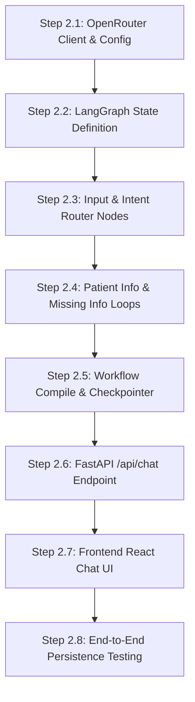

# Phase 2 Implementation Plan: Conversation & LangGraph Setup

This document outlines the sequential, testable steps required to implement Phase 2 of the **AI Hospital Appointment Orchestrator**. 

---

## 🙋‍♀️ Confirmed Design Decisions
The following constraints and specifications are finalized for this phase:

> [!NOTE]
> 1. **Model Constraint**:
>    * We will **exclusively** use the OpenRouter model: **`google/gemma-4-31b:free`**.
>    * All agent nodes will call this model through the OpenRouter API endpoint (`https://openrouter.ai/api/v1`).
> 2. **State & Checkpointing**:
>    * LangGraph state is shared across all nodes.
>    * Session persistence will be handled via LangGraph's checkpointer mechanism, allowing conversations to resume seamlessly.

---

## 🗺️ Step-by-Step Implementation



---

### Step 2.1: OpenRouter LLM Client & Config Setup
* **Objective**: Configure the target LLM and establish the OpenRouter client connection helper.
* **Scope**: Load configurations, configure headers, and write a test invocation script.
* **Files to Create/Modify**:
  * Modify `backend/config.py` (Add `OPENROUTER_MODEL` default value)
  * Modify `backend/.env` (Define `OPENROUTER_MODEL=google/gemma-4-31b:free`)
  * Create `backend/utils/llm.py`
* **Implementation Tasks**:
  1. Add `OPENROUTER_MODEL: str = "google/gemma-4-31b:free"` to `Settings` in `backend/config.py`.
  2. Implement `backend/utils/llm.py` using `ChatOpenAI` (from `langchain_openai`) or a custom OpenRouter wrapper:
     ```python
     from langchain_openai import ChatOpenAI
     from backend.config import settings
     
     def get_llm():
         return ChatOpenAI(
             openai_api_key=settings.OPENROUTER_API_KEY,
             openai_api_base="https://openrouter.ai/api/v1",
             model=settings.OPENROUTER_MODEL,
             default_headers={
                 "HTTP-Referer": "https://sunrisehospital.com",
                 "X-Title": "AI Hospital Appointment Orchestrator"
             }
         )
     ```
  3. Write a connection verification script/command to execute a basic prompt test using the LLM and print the output.
* **Validation & Edge Cases**:
  * Execute test invocation to verify `google/gemma-4-31b:free` responds successfully.
* **Definition of Done**: LLM client is initialized and returns mock completions without authorization or configuration errors.

---

### Step 2.2: LangGraph State Definition
* **Objective**: Define the shared graph state schema.
* **Scope**: Typings, defaults, and reducers for messages and conversation keys.
* **Files to Create**:
  * Create `backend/graph/state.py`
* **Implementation Tasks**:
  1. Define `HospitalState` (inheriting from `typing.TypedDict` or using Pydantic):
     - `messages`: List of message objects (using a reducer to append new messages).
     - `user_id`: UUID of the authenticated patient.
     - `language`: Inferred language ('English', 'Hindi', 'Gujarati').
     - `intent`: Classified user intent ('BOOK', 'CANCEL', 'RESCHEDULE', 'CHECK_STATUS').
     - `patient_info`: Dict containing `name` (str), `age` (int), `gender` (str), `phone` (str).
     - `symptoms`: Dict containing `symptoms` (list), `duration` (str), `severity` (str), `body_part` (str).
     - `department`: Target department.
     - `priority`: 'LOW', 'MEDIUM', 'HIGH', 'EMERGENCY'.
     - `doctor_candidates`: List of matched doctor IDs.
     - `selected_doctor`: ID of selected doctor.
     - `available_slots`: List of slot IDs.
     - `selected_slot`: Slot details dict.
     - `booking_status`: Current status.
     - `errors`: List of error messages.
* **Definition of Done**: `HospitalState` is defined and correctly compiles.

---

### Step 2.3: Input & Intent Router Nodes
* **Objective**: Implement the natural language validation, language detection, and intent classification agents.
* **Scope**: Text cleaning, language detection, and routing decision rules.
* **Files to Create**:
  * Create `backend/prompts/intent.py`
  * Create `backend/graph/nodes/input.py`
  * Create `backend/graph/nodes/intent.py`
* **Implementation Tasks**:
  1. Write prompt templates for intent routing and language inference.
  2. Implement **Input Node**: Detects input language. If empty or unsupported, flags an error in the state.
  3. Implement **Intent Node**: Invokes LLM to classify user intention. Supports standard greetings (responses that transition to `END` or loop back).
* **Validation & Edge Cases**:
  * Test input "I want to book an appointment" -> sets intent to `BOOK`.
  * Test input "Hi" or greeting -> handles greeting, returns friendly help, routes to `END`.
* **Definition of Done**: Input and Intent nodes process text and output structured attributes correctly.

---

### Step 2.4: Patient Info & Missing Info Loops
* **Objective**: Extract patient profile details and check for missing mandatory information.
* **Scope**: Form filling (slot-filling) and follow-up query loops.
* **Files to Create**:
  * Create `backend/graph/nodes/patient_info.py`
  * Create `backend/graph/nodes/missing_info.py`
* **Implementation Tasks**:
  1. Implement **Patient Info Node**: Uses LLM tool calling / structured output to extract profile fields (`name`, `age`, `gender`, `preferred_language`) from the conversation history.
  2. Implement **Missing Info Checker Node**:
     - Inspects if any mandatory fields are missing: `name`, `age`, `gender` (for patient profile) and `symptoms` (for booking).
     - If info is missing: sets `next_action = "ask_user"`, writes a prompt in the message list asking for the missing info.
     - If all info is present: sets `next_action = "continue"`.
* **Validation & Edge Cases**:
  * Test missing age -> triggers question asking for age and routes back to patient.
  * Test full information provided -> skips questions and sets state to continue.
* **Definition of Done**: Info extraction correctly updates the patient profile, and the missing checker successfully identifies unfilled slots.

---

### Step 2.5: LangGraph Workflow Compile & Checkpointer
* **Objective**: Assemble and compile the graph workflow with a state checkpointer.
* **Scope**: Node registrations, conditional edges, and memory checkpointing.
* **Files to Create**:
  * Create `backend/graph/workflow.py`
* **Implementation Tasks**:
  1. Build a `StateGraph(HospitalState)` instance.
  2. Register all completed nodes: `input`, `intent`, `patient_info`, `missing_info`, `ask_user`.
  3. Set entry point to `input` node.
  4. Configure conditional routing edges:
     - `input` -> `intent`
     - `intent` (based on intent) -> if `BOOK` route to `patient_info`, otherwise route to appropriate handler (or `END`).
     - `patient_info` -> `missing_info`
     - `missing_info` -> if `ask_user` route to `ask_user` node, if `continue` route to `END` (pending Phase 3 booking logic).
  5. Configure memory checkpointer (e.g. `MemorySaver`) to manage state persistence across sessions.
* **Definition of Done**: The StateGraph builds, links conditional routes, and compiles without cyclic or syntax errors.

---

### Step 2.6: FastAPI Chat API Endpoint
* **Objective**: Create the primary conversational interface endpoint.
* **Scope**: Conversation loading, checkpointer session matching, and API response mapping.
* **Files to Create/Modify**:
  * Create `backend/routers/chat.py`
  * Modify `backend/main.py` (Include chat router)
* **Implementation Tasks**:
  1. Implement `POST /api/chat` route (requires JWT Authentication token).
  2. Expects JSON payload: `{"session_id": str, "message": str}`.
  3. Look up or initialize the conversation history.
  4. Execute the compiled LangGraph workflow with the user message, passing `session_id` to the checkpointer config.
  5. Save the updated conversation state back to the PostgreSQL `conversations` table.
  6. Return the updated messages thread and current state profile.
* **API Endpoints**:
  * `POST /api/chat`
* **Validation & Edge Cases**:
  * Verify token validation checks (unauthorized calls must block).
* **Definition of Done**: Chat API endpoint processes messages, triggers the compiled LangGraph flow, and returns the response payload.

---

### Step 2.7: Frontend React Chat Screen
* **Objective**: Implement the AI Chat conversation interface in the React client.
* **Scope**: Scrollable chat box, text input form, Axios chat handler, and dashboard layout.
* **Files to Create/Modify**:
  * Modify `frontend/src/pages/PatientDashboard.jsx` (Integrate Chat UI)
* **Implementation Tasks**:
  1. Design a premium, clean chat screen with double-column layout:
     - **Left Column**: Displays extracted patient info profile (Name, Age, Gender, Language, Symptoms) dynamically updating from graph state.
     - **Right Column**: Interactive scrollable message history.
  2. Wire the message inputs to trigger requests to the backend `/api/chat` endpoint.
  3. Implement speech recognition button placeholder (pre-trigger for Voice input).
* **Validation & Edge Cases**:
  * Send text and confirm both patient bubble and bot response bubble are added to the list.
* **Definition of Done**: Fully interactive chat page renders nicely and coordinates requests with backend in real-time.

---

### Step 2.8: End-to-End Chat & State Persistence Testing
* **Objective**: Verify full conversation loops and state checks.
* **Scope**: Conversational testing, token expiry resilience, and DB verification.
* **Implementation Tasks**:
  1. Start backend and frontend.
  2. Log in as a patient, open chat, and type: "Hello, my name is John."
  3. Verify the AI response asks for age and symptoms.
  4. Verify the database `conversations` table is updated with the message list and `current_state` tracks the extracted `name`.
* **Definition of Done**: Complete basic profile slot-filling dialog runs successfully with persistent state recorded in the database.
