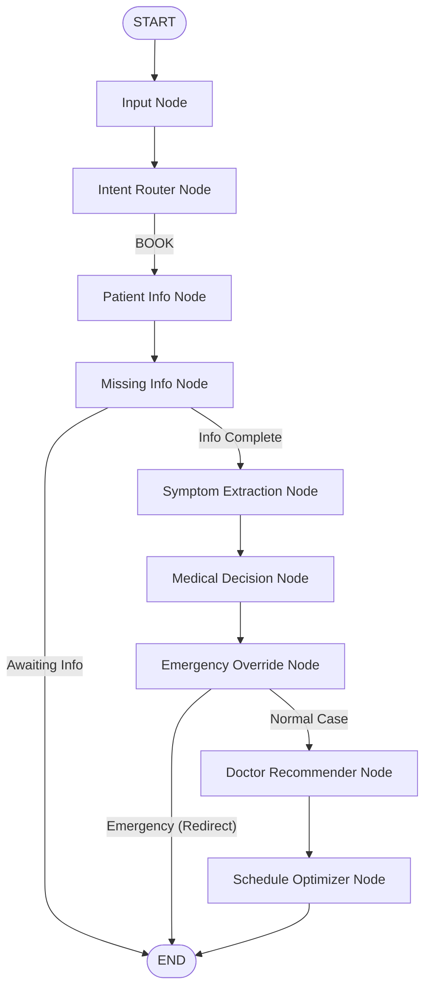

# Phase 3: Booking Flow (Symptom Extraction & Medical Triage)

This phase implements the medical intelligence and booking coordination layers of the AI Hospital Appointment Orchestrator using a multi-agent LangGraph workflow.

---

## 🏗️ Architectural Overview

We will extend the existing compiled LangGraph with four new nodes and conditional routing logic.



---

## 🛠️ Proposed Nodes & Logic

### 1. Symptom Extraction Agent (`symptom_node`)
* **Purpose**: Parse natural language user complaints and extract structured symptom key-values.
* **Input**: User message history.
* **Output**: Writes to `symptoms` key in `HospitalState`:
  ```python
  class SymptomInfo(TypedDict, total=False):
      symptoms: List[str]
      duration: Optional[str]
      severity: Optional[str]   # Mild, Moderate, Severe
      body_part: Optional[str]
  ```
* **LLM Prompt**: Instructs model to return JSON containing the above fields.

### 2. Medical Decision Agent (`medical_decision_node`)
* **Purpose**: Perform medical triage based on symptoms and suggest the appropriate clinical department and priority level.
* **Logic**:
  - Recommends one of the 10 hospital departments (General Medicine, Cardiology, Orthopedics, Neurology, Pediatrics, Dermatology, ENT, Gynecology, Ophthalmology, Dentistry).
  - Assesses patient urgency and assigns a `priority` level: `LOW`, `MEDIUM`, `HIGH`, or `EMERGENCY`.
* **Output**: Updates state keys `department` and `priority`.

### 3. Emergency Override Agent (`emergency_node`)
* **Purpose**: Immediately intercept severe symptoms to prioritize patient safety.
* **Logic**:
  - Triggered if `priority == EMERGENCY` or if critical keywords are extracted (e.g. chest pain + breathing difficulty, stroke signs like facial drooping/slurred speech, severe active bleeding).
  - Bypasses booking slots completely.
  - Returns a high-priority warning message advising the patient to go to the emergency room immediately or call the Sunrise emergency hotline at **+91 79 4012 3999**.
  - Sets `booking_status` to `emergency_redirect` and routes to `END`.

### 4. Doctor Recommender Agent (`doctor_recommender_node`)
* **Purpose**: Query database to find suitable doctor matches.
* **Logic**:
  - Queries `doctors` table filtered by `department` matching the recommended department.
  - Matches the doctor's languages against the user's preferred language (`state["language"]`).
  - Ranks candidates by years of experience and consultation fee.
* **Output**: Populates `doctor_candidates` list in `HospitalState`.

### 5. Schedule Optimizer Agent (`schedule_node`)
* **Purpose**: Retrieve and present available booking slots for the patient.
* **Logic**:
  - Queries `doctor_schedules` table for the matching doctors over the next 30 days.
  - Filters out Indian national/public holidays (Republic Day, Holi, Independence Day, Gandhi Jayanti, Diwali, Christmas).
  - Excludes slots that are already booked or fall outside working hours (8:00 AM - 8:00 PM).
  - Sorts by earliest date and presents the top 3 candidate slots to the user.
* **Output**: Populates `available_slots` list in `HospitalState` and appends an AI message asking the patient to confirm a slot.

---

## 🗃️ DB Schema Verification
No database schema changes are required. We will query existing tables:
* `users`
* `doctors`
* `doctor_schedules`
* `appointments`

---

## 🧪 Verification Plan

### Automated Test Script (`test_booking_flow.py`)
We will create a script simulating a patient complaints flow:
1. **Case A (Normal Patient)**:
   - Registers test user.
   - User complains: *"I have had a red itchy skin rash on my arms for 3 days."*
   - Asserts:
     - Language = English
     - Symptoms list has `["rash", "itchy skin"]`
     - Recommended Department = `Dermatology`
     - Recommended Doctor = `Dr. Riya Shah` (matches Dermatology + English)
     - Booking priority = `LOW` or `MEDIUM`
     - Returns top 3 slots.
2. **Case B (Emergency Patient)**:
   - User complains: *"My chest hurts severely and I can't breathe."*
   - Asserts:
     - Priority = `EMERGENCY`
     - Booking is bypassed (`booking_status == "emergency_redirect"`).
     - Response instructs the user to call emergency phone number or visit the ER.
